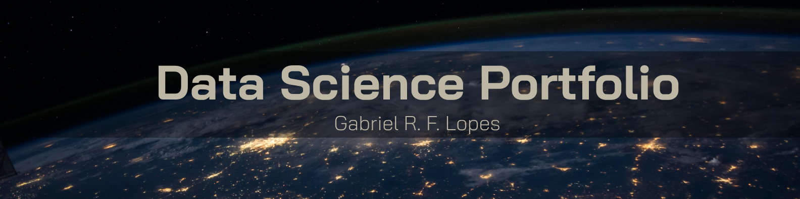

# Portfolio

Este repositório é uma reunião dos meus trabalhos com _data science_.

  

## Gabriel R. F. Lopes
*Cientista de dados e MsC. em Física*

Com a experiência sendo pesquisador em Física, conduzi experimentos que se apoiavam principalmente na análise, visualização e apresentação de dados. Trabalhei para transformar informação em conhecimento através da interpretação de variáveis e conceitos de física e matemática avançadas utilizandos dados.

No estudo de _data science_, pretendo utilizar desse conhecimento para ajudar negócios e pessoas com soluções de análise e tratamento de dados. Complementando essa experiência passada com pesquisa científica, estou me especializando em bibliotecas como Pandas, Numpy, Matplotlib, Seaborn, além de áreas como Machine Learning, Inteligência Artificial e Visão Computacional.

Busco apresentar meus códigos sempre de maneira organiza e bem documentada, seguindo os princípios do _data storytelling_ para melhorar o entendimento e hierarquização das informações. Nas minhas análises, busco seguir uma metodologia científica para tirar conclusões precisas e não-intuitivas.

Minhas credenciais incluem: um Mestrado em Física pela Universidade Federal de Itajubá (UNIFEI), uma instituição de educação superior e pesquisa avançada ranqueada entre as melhores escolas de engenharia do Brasil. Lá, trabalhei com caracterização elétrica de semicondutores, com aplicações em sensores optoeletrônicos e dispositivos eletrônicos.

* **Habilidades**: 

Python; Análise de dados com Pandas e Numpy; Visualização de dados com Matplotlib e Seaborn; Machine Learning com Scikit-Learn e Tensorflow; SQL; LaTeX; Matemática avançada (Cálculo, Cálculo Vetorial, Álgebra Linear); Conhecimento avançados em probabilidade e estatística; Conhecimentos avançados em tecnologia de semicondutores e sensores; Física.

* **Soft Skills:** 

Pensamento Analítico de problemas; Escrita Científica; Oratória; Comunicação interpessoal; Organização.

* **Idiomas:**

Inglês avançado (Excelente conversação, escrita e leitura); Espanhol básico (Entende bem, Lê bem e pouca experiência em conversação).

## Projetos:

1. [Analisando os dados do AirBnb na cidade de Roma](https://github.com/gabrielrflopes/Rome_Airbnb_Data_Analysis) - Neste projeto, utilizei os dados disponíveis no Inside AirBnb para fazer uma análise exploratória completa dos dados, identificando média de preços, tipos de imóveis mais comuns, média de noites, médias de preços por bairros e a distribuição geográfica de imóveis classificados por preço.
2. [Panorama do COVID-19 no Brasil e no mundo](https://github.com/gabrielrflopes/covid_project) - Nesse projeto, utilizei os dados fornecidos pelo *Our World in Data* para analisar o panorama do COVID no Brasil e no mundo. O foco foi em avaliar a evolução da pandemia, os países mais afetados e o efeito da vacinação sobre casos e mortes.

### Artigos:

* [Personal Branding](https://www.linkedin.com/pulse/urg%25C3%25AAncia-de-causar-uma-boa-impress%25C3%25A3o-gabriel-ribeiro-ferreira-lopes/?trackingId=EjBT1icNTLeqkPLBvieGOQ%3D%3D)
* [Decisões orientadas por dados](https://www.linkedin.com/pulse/alguns-fatos-incontest%C3%A1veis-sobre-decis%C3%A3o-orientada-gabriel/)
* [Analisando os dados do AirBnb na cidade de Roma](https://grflopes.medium.com/analisando-os-dados-do-airbnb-na-cidade-de-roma-4ee6af13bbdc) 
* [Como usar cada tipo de gráfico no contexto certo usando o Matplotlib](https://grflopes.medium.com/como-usar-cada-tipo-de-gr%C3%A1fico-no-contexto-certo-usando-o-matplotlib-c640bbcdfe79)
* [Criando interações com gráficos usando o iPyWidgets](https://medium.com/@grflopes/criando-intera%C3%A7%C3%B5es-com-gr%C3%A1ficos-usando-o-ipywidgets-49a83dad43ec)
* [Panorama do COVID-19 no Brasil e no mundo](https://medium.com/@grflopes/panorama-do-covid-19-no-brasil-e-no-mundo-a67cfb94af5f)
* [O dicionário de conceitos fundamentais em Data Science](https://grflopes.medium.com/o-dicionário-de-conceitos-fundamentais-em-data-science-c818b04e3a2b)

### Artigos Acadêmicos:

**Área: Física da Matéria Condensada**

* [Photoconductivity effect in SnTe quantum well (Applied Physics Letters)](https://pubs.aip.org/aip/apl/article/119/3/032104/41763/Photoconductivity-effect-in-SnTe-quantum-well)
* [Weak antilocalization effect and multi-channel transport in SnTe quantum well](https://pubs.aip.org/aip/apl/article/120/20/203102/2833593/Weak-antilocalization-effect-and-multi-channel)

**Links importantes:**
* [LinkedIn](https://www.linkedin.com/in/gabrielrflopes/)
* [Medium](https://medium.com/@grflopes)
* [Instagram](https://www.instagram.com/gabrielr.lopes/)
